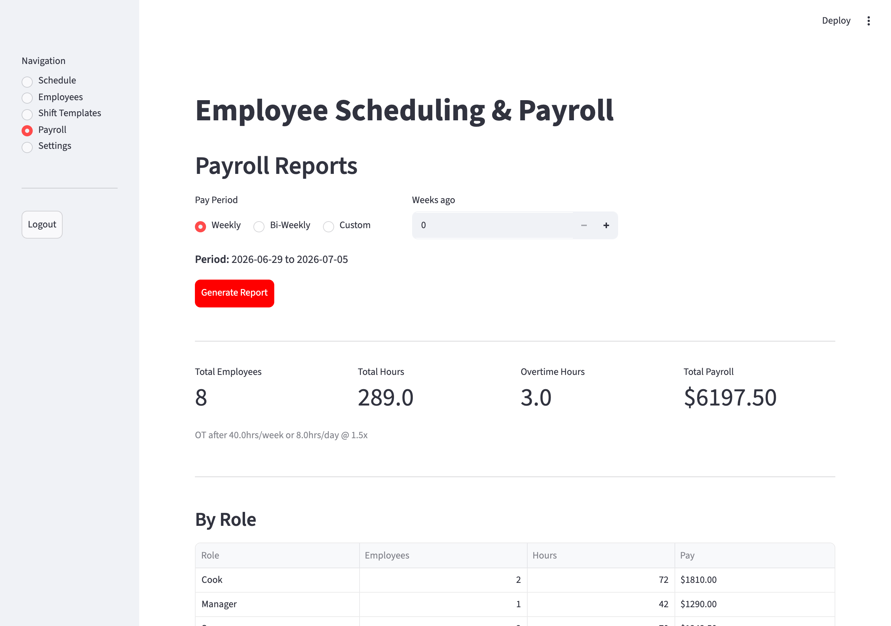
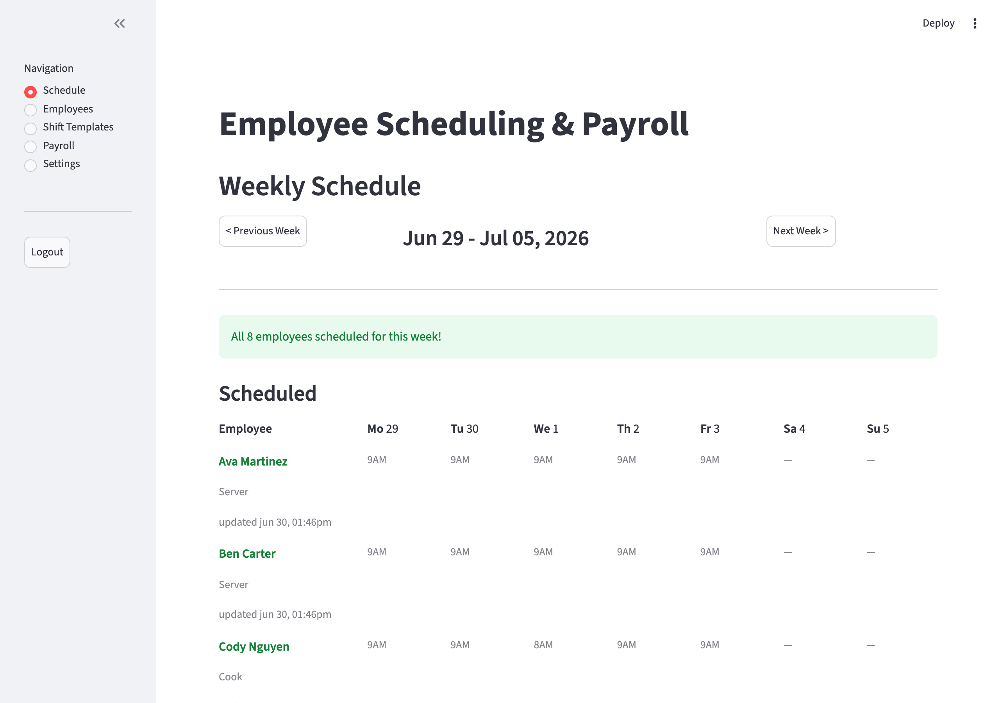

# Staff Scheduling &amp; Payroll

[](https://github.com/squireaintready/staff-scheduling/actions/workflows/ci.yml)

[](https://github.com/astral-sh/ruff)
[](LICENSE)

A Streamlit web app for managing employee shift schedules and running payroll for a
small hospitality team. It replaced a manual spreadsheet for a real 15-person restaurant:
managers schedule shifts in a weekly grid, and the app computes hours, overtime, and pay —
with daily **and** weekly overtime rules, lunch deductions, and per-role reporting.



> **Live demo:** deploy your own in ~2 minutes — see [Deployment](#deployment).
> The demo login password is `demo`; sample data resets on each restart.

---

## Features

- **Weekly schedule grid** — assign shifts per employee per day, with reusable shift
  templates (Morning / Mid / Evening) and one-click "apply template to selected days."
- **Payroll engine** — computes regular vs. overtime hours using configurable daily and
  weekly thresholds and an overtime multiplier, with automatic lunch deductions.
- **Roles** — every employee has a role (Server, Cook, Manager, …); the schedule and a
  dedicated payroll subtotal break hours and pay down **by role**.
- **Reports &amp; export** — summary metrics, a pay-distribution chart, a per-employee
  breakdown, and CSV export of both payroll and the schedule grid.
- **Authentication** — password-gated manager access (timing-safe comparison).
- **Input validation** — rejects invalid shifts (end before start, lunch outside the
  shift) and duplicate/empty employee names before they reach the database.
- **Responsive** — usable on phone and tablet (horizontal-scrolling grid, touch targets).

## Tech stack

| | |
|---|---|
| **Language** | Python 3.11+ |
| **UI** | Streamlit |
| **Data** | SQLite (no ORM — a small hand-rolled data-access layer) |
| **Reports** | pandas |
| **Quality** | pytest · ruff · mypy · GitHub Actions CI |

## Architecture

The app is split into thin, single-responsibility modules so the business logic stays
independent of the UI and is straightforward to test:

```
app.py            # entry point: page config, styling, auth gate, navigation
auth.py           # password gate
styles.py         # CSS
timeutils.py      # pure 12h/24h time helpers (no Streamlit import)
validation.py     # pure input validators
payroll.py        # payroll/overtime engine (pure functions + dataclasses)
database.py       # SQLite data-access layer (parameterized queries)
views/            # one module per page, each exposing render()
  ├── schedule.py
  ├── employees.py
  ├── templates.py
  ├── payroll.py
  └── settings.py
tests/            # unit, data-layer, integration, and headless app tests
```

The payroll engine (`payroll.py`) is pure and deterministic — it takes hours and rules and
returns `EmployeePayroll` dataclasses — so the trickiest logic is covered by fast unit
tests with no database or browser involved.

## Getting started

```bash
# 1. Install (project + dev tools)
pip install -e ".[dev]"

# 2. Configure the manager password
mkdir -p .streamlit
echo 'password = "your-password"' > .streamlit/secrets.toml

# 3. (Optional) seed realistic sample data
python seed_demo.py

# 4. Run
streamlit run app.py
```

The app opens at `http://localhost:8501`.

## Testing

```bash
pytest          # run the full suite
ruff check .    # lint
mypy            # type-check the logic + data layers
```

The suite covers four levels and runs on every push via [GitHub Actions](.github/workflows/ci.yml):

- **Unit** — the payroll engine (overtime distribution, overnight wrap, lunch
  deduction, pay-period dates), time helpers, and validators.
- **Data layer** — CRUD round-trips against an isolated temporary SQLite database.
- **Integration** — seed employees + shifts, then assert the generated payroll report.
- **App** — a headless [`AppTest`](https://docs.streamlit.io/develop/api-reference/app-testing)
  that logs in and renders every page, plus a full report generation.

## Security

- **Authentication** — the manager password is compared with `hmac.compare_digest`
  (constant-time) and is read from Streamlit secrets, never committed to the repo.
- **SQL injection** — every query that touches user input is parameterized.
- **Rendering** — user-entered values are rendered as escaped Markdown (no raw HTML),
  and the only `unsafe_allow_html` usage is a static stylesheet.
- **Validation** — shift and employee inputs are validated before any database write.

## Deployment

The app deploys free on [Streamlit Community Cloud](https://streamlit.io/cloud):

1. Push this repo to your GitHub account.
2. On Streamlit Community Cloud, **New app → pick this repo → `app.py`**.
3. In the app's **Settings → Secrets**, add:
   ```toml
   password = "demo"
   ```
4. (Optional) run `seed_demo.py` once, or add employees in the UI. Community Cloud's
   filesystem is ephemeral, so the SQLite database resets when the app restarts — which
   keeps a public demo self-cleaning.

## Screenshots

| Weekly schedule | Payroll report |
|---|---|
|  |  |

## License

MIT — see [LICENSE](LICENSE).

## Author

**Samuel Jo** — [GitHub](https://github.com/squireaintready) · [LinkedIn](https://linkedin.com/in/samuel-jo)
